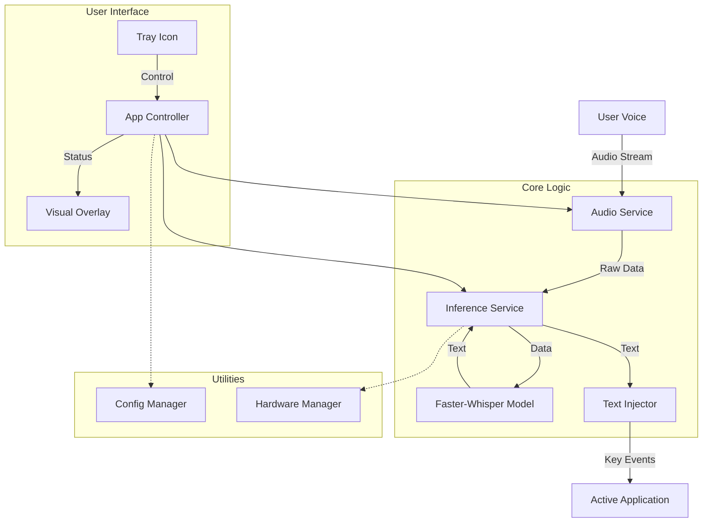

# WhisperTyper


**A local, privacy-first voice-to-text tool for Windows that runs completely offline. No API keys, no cloud data.**

WhisperTyper brings the power of OpenAI's Whisper model directly to your desktop, allowing you to dictate text into *any* application with global hotkey support.

---

## ✨ Key Features

*   **🔒 Privacy First:** Runs locally using `faster-whisper`. Your voice data never leaves your machine.
*   **🖥️ Smart Overlay:** Non-intrusive, always-on-top overlay that provides visual feedback without stealing focus from your active window.
*   **🚀 Hardware Aware:** Automatically detects NVIDIA GPUs (CUDA) for acceleration. Includes intelligent **AMD/CPU fallback** logic for maximum compatibility.
*   **🎙️ Modern Audio:** Advanced filtering for Windows audio devices (prioritizes WASAPI, removes duplicates).
*   **⚡ Fast & Fluid:** Global Hotkey (`Ctrl+Alt+Shift+S`) to toggle recording instantly. Supports **Hot-Swapping** models without restarting.
*   **🛠️ User Friendly:** System Tray integration, Smart Language Detection, and Hallucination Filtering.
*   **🔄 Factory Reset:** Easily restore default settings via the Settings dialog if things get messy.
*   **🧠 Smart Hardware Detection:** Automatically prioritizes NVIDIA GPUs (CUDA) and transparently falls back to CPU for AMD/Intel, ensuring the app works on any Windows machine.

---

## 📥 Installation

### For Users
1.  Download the latest release (`.exe` or `.zip`) from the [Releases](#) page.
2.  Run `WhisperTyper.exe`.
3.  The app runs in the system tray. Use **Ctrl+Alt+Shift+S** to start dictating!

### For Developers

**Prerequisites:** Python 3.10+

1.  **Clone the repository:**
    ```bash
    git clone https://github.com/yourusername/whisper-typer.git
    cd whisper-typer
    ```

2.  **Install dependencies:**
    This project uses `uv` for fast dependency management, but supports standard pip.
    ```bash
    # Option A: Using uv (Recommended)
    uv sync
    
    # Option B: Standard pip
    pip install -r requirements.txt
    ```

3.  **Run the application:**
    ```bash
    uv run src/main.py
    # or
    python src/main.py
    ```

---

## 🏗️ Architecture

WhisperTyper follows a strictly modular **Controller-Service** architecture to ensure stability and responsiveness.



---

## 🔧 Troubleshooting

*   **Microphone Permissions:** Ensure WhisperTyper has permission to access your microphone in **Windows Settings > Privacy > Microphone**.
*   **Antivirus:** Some antivirus software may flag the text injection (keyboard simulation) as suspicious. Add an exception if necessary.
*   **AMD GPUs:** Native hardware acceleration is currently optimized for NVIDIA (CUDA). AMD GPUs will be detected but will default to CPU mode for stability unless a compatible ROCm environment is manually configured.

---

## 📜 License

Distributed under the MIT License. See `LICENSE` for more information.
