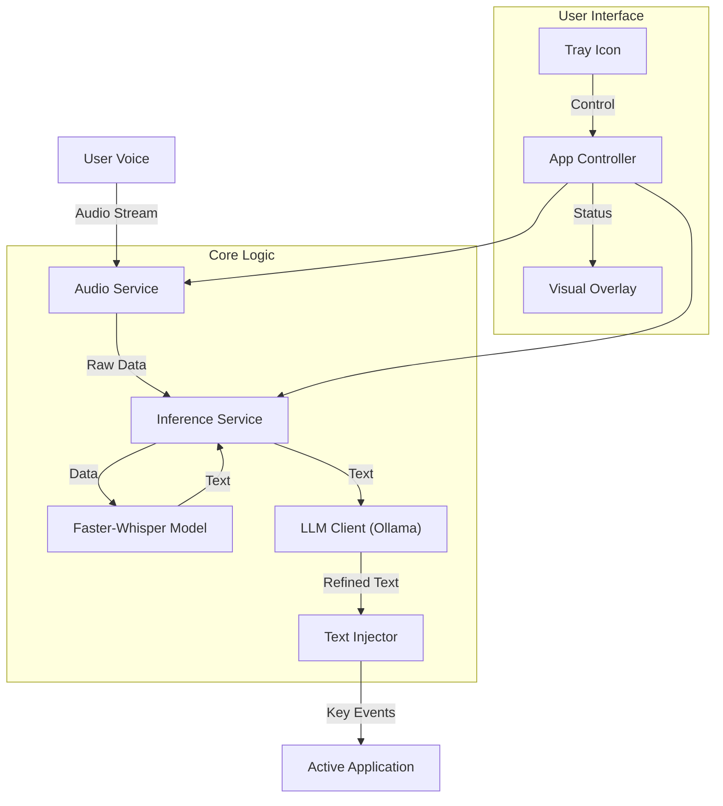

# Architecture

WhisperTyper follows a strictly modular **Controller-Service** architecture to ensure stability, responsiveness, and safe multithreading. It uses **Qt Signals & Slots** to safely bridge the gap between background worker threads and the main UI thread.

## Thread-Safe Worker Approach

- **AppController**: The central brain. It routes data and commands between the UI and background services.
- **AudioService**: Runs on its own thread, capturing raw audio data from your microphone and emitting chunks without blocking the UI.
- **InferenceService**: Runs the heavy AI lifting on another dedicated thread. It processes the audio chunks using `faster-whisper`.

## Local LLM Pipeline

The audio processing pipeline is designed for speed and flexibility:
1. **Audio Capture**: User speaks, and raw audio is piped to the `AudioService`.
2. **Transcription**: The `InferenceService` loads the `faster-whisper` model and transcribes the audio to raw text.
3. **Smart Rewriting**: If enabled, the text is passed to the `LLMProcessor` which makes a local REST API call to Ollama.
4. **Injection**: Finally, the `TextInjector` simulates keystrokes to type the finalized text into the active Windows application.

